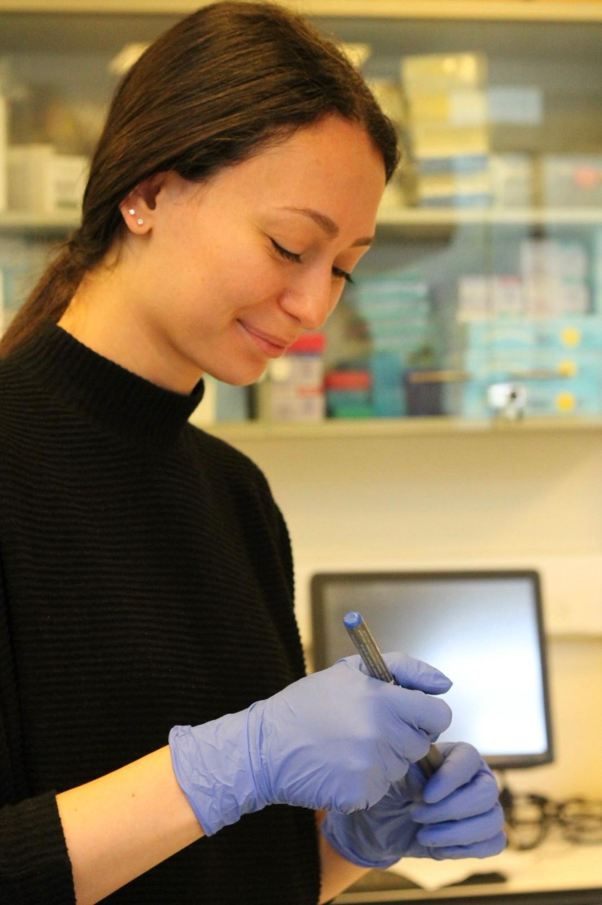

<link rel="stylesheet" href="style.css">

  

    <h1>🍁 Achinoam Shoham</h1>
    

      Hi! I'm <a href="https://weizmann.elsevierpure.com/en/persons/achinoam-shoham/">Achinoam</a>, 
      a PhD student at the Weizmann Institute of Science and a member of the 
      <a href="https://barkailab.wixsite.com/barkai">Barkai Lab</a>. 
      We study how transcription factors locate their specific binding sites within the vast genome. 
      My research focuses on the role of intrinsically disordered regions (IDRs) in gene expression regulation. 
      I combine experimental and computational approaches to study how IDRs influence the binding preferences of transcription factors in mammalian cells.
    

  

  

<h2>🧬 Scientific Focus</h2>
<ul>
  <li>Transcription factor dynamics</li>
  <li>Disordered protein regions</li>
  <li>Gene regulation mechanisms</li>
  <li>Systems biology</li>
  <li>Protein-DNA interactions</li>
  <li>Quantitative biology</li>
</ul>

<h2>🪴 When I'm not in the Lab I enjoy:</h2>
<ul>
  <li>Traveling</li>
  <li>Working out</li>
  <li>Caring for my ~30 plants at home</li>
  <li>Spending time with my cat Manny 🐱</li>
</ul>

  ✉️ You can reach me at 
  <a href="mailto:achinoam.shoham@weizmann.ac.il">achinoam.shoham@weizmann.ac.il</a>

